# Mouvement Server-Authoritatif pour jeux d'action en temps réel (Unity + Netcode for GameObjects)

#### Avec Client-Side Prediction, Server Reconciliation, Sticky Inputs

*Un guide pour créer un système de mouvement en multijoueur **performant**, **réactif** et **sécurisé** de niveau professionnel.*

**Une base pour créer le mouvement server-authoritatif dans Unity est fournie dans le repository**

---

### Table des Matières

1. [Introduction - Le Problème Fondamental](#introduction)
2. [Le Système de Ticks - Fondation Temporelle](#le-système-de-ticks---fondation-temporelle)
3. [PARTIE 1 : Les Inputs (Input System)](#partie-1--les-inputs-input-system)
4. [PARTIE 2 : Le Calcul (Physics & Simulation)](#partie-2--le-calcul-physics--simulation)
5. [PARTIE 3 : La Réconciliation (Correction & Synchronisation)](#partie-3--la-réconciliation-correction--synchronisation)
6. [Les Trois Perspectives](#les-trois-perspectives)
7. [Conclusion & Ressources](#conclusion--ressources)

---

### Introduction

#### Comment implémenter un système de mouvement robuste ?

Pour implémenter le mouvement dans un jeu multijoueur, il existe deux approches principales :

| Aspect | Client-Authoritative | Server-Authoritative |
|--------|---------------------|----------------------|
| **Qui contrôle** | Le joueur contrôle sa position | Le serveur contrôle la position des joueurs |
| **Fonctionnement** | Le client calcule et envoie sa position. Le serveur et les autres joueurs l'acceptent comme vérité. | Les joueurs envoient leurs inputs. Le serveur calcule et renvoie la vraie position. |
| **✅ Avantages** | Fluide (aucune latence perceptible pour le joueur), Simple à implémenter, Code exécuté localement | Sécurisé (empêche la triche), Centralisé (source de vérité unique), Serveur valide tous les mouvements |
| **❌ Inconvénients** | Vulnérable à la triche (téléportation, speed hack), Décentralisé (pas de source de vérité), Conflits de position possibles | Latence visible sans optimisation, Complexe à implémenter, Nécessite prédiction + réconciliation |
| **Usage typique** | Jeux coopératifs casual, single-player avec multijoueur secondaire | Jeux compétitifs (CS:GO, Valorant, Overwatch, Apex, Fortnite) |

**Tous les jeux compétitifs modernes utilisent l'approche Server-Authoritative** pour deux raisons critiques :

1. **Sécurité** : Impossible de tricher car tous les calculs sont validés côté serveur
2. **Équité** : Une seule source de vérité pour tous les joueurs

L'implémentation du mouvement server-authoritatif semble simple : il suffit d'envoyer ses inputs et le serveur calcule la position, mais il y a un problème majeur : la latence. Comme les jeux sont hébergés en ligne et non en local, il y a un délai entre l'envoi des informations et leur réception.

Le RTT (Round-Trip Time : temps de trajet des informations client → serveur → client) est souvent élevé et se remarque dans un jeu, même avec une connexion très stable (~100ms).

**À 60 FPS, 100ms c'est 6 frames de retard !** Essayer de jouer à un FPS où le personnage bouge 5 frames après avoir pressé une touche est **Impossible.**

#### La Solution : le Client-Side Prediction (et la Server Reconciliation)

Pour ne pas avoir à subir le lag, le joueur peut calculer de son côté le déplacement. Cela donnera l'impression qu'il n'y a pas de latence entre le serveur et le joueur.

Mais cette solution n'est pas parfaite : les états du jeu ne seront pas exactement les mêmes entre le client et le serveur. Il faut donc appliquer une correction de la position du joueur s'il n'est pas au même endroit que le serveur.

#### Architecture finale du Server-Authoritative Movement

Voici l'architecture complète combinant **Client-Side Prediction** et **Server Reconciliation** :

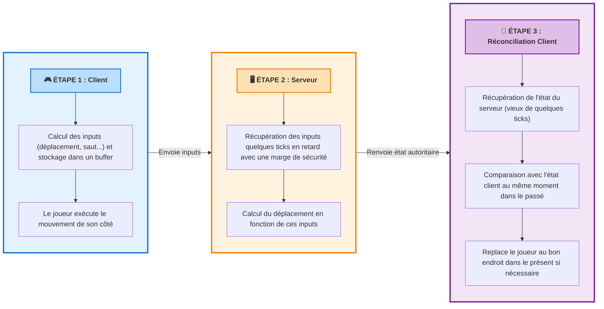

---

## Le Système de Ticks - Fondation Temporelle

#### Pourquoi des Ticks et pas du Temps Réel ?

**Le système de ticks est la pierre angulaire de toute l'architecture**. Il est utilisé pour :
- Synchroniser les inputs entre client et serveur
- Identifier précisément les états à rejouer lors de la réconciliation
- Compenser la latence de manière prévisible
- Maintenir un timing cohérent malgré les variations de framerate

#### Le Problème du Temps Réel

Si on utilisait directement le temps réel au lieu des ticks, voici ce qui se passerait :

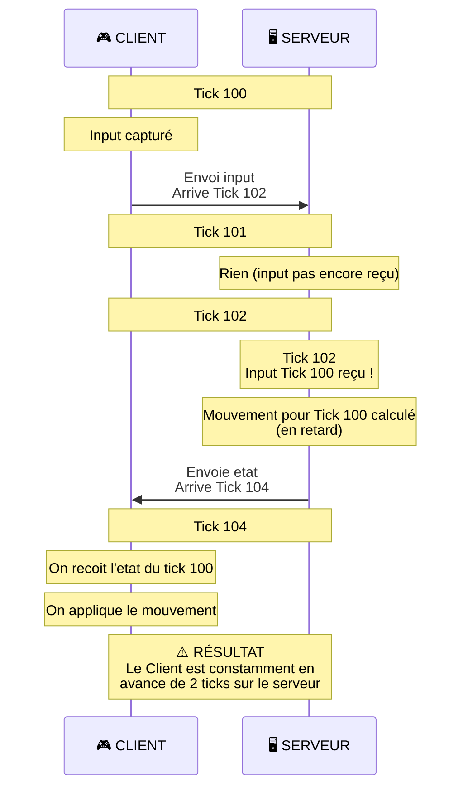

#### Qu'est-ce qu'un Tick ?

Les **ticks** sont des unités discrètes de temps partagées entre tous les clients et le serveur. Chaque tick représente une "frame réseau" pendant laquelle :

- Les inputs sont capturés et horodatés
- Les simulations physiques sont calculées
- Les états sont synchronisés

Ces unités permettent de synchroniser et comparer les informations du client et du serveur au bon moment, indépendamment de la latence réseau ou du framerate local.

**Tick Rates Communs dans l'Industrie** :

| Jeu | Tick Rate | Commentaire |
|---|---|---|
| CS:GO | 64 Hz (casual), 128 Hz (compétitif) | Standard FPS |
| Valorant | 128 Hz | Haute précision |
| Overwatch | 60 Hz | Bon compromis |
| Fortnite | 30 Hz | Optimisé pour bande passante (100 joueurs) |
| Rocket League | 60 Hz | Haute vitesse, compétitif |

#### Fonctionnement du Système de Ticks

Le client sera quelques ticks en avance sur le serveur, pour compenser la latence :

- Serveur : Tick actuel = Tick
- Client : Tick actuel = Tick + RTT/2 + Marge de securite

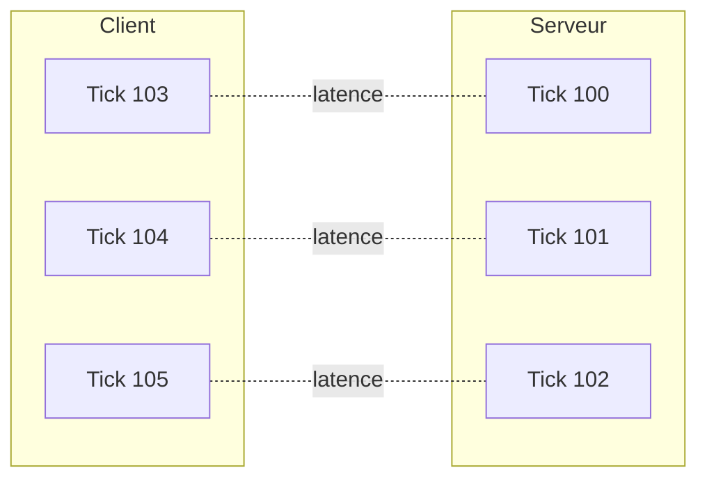

#### Pourquoi une Marge de Sécurité ?

Le **jitter** (variation de latence) est l'ennemi du netcode :

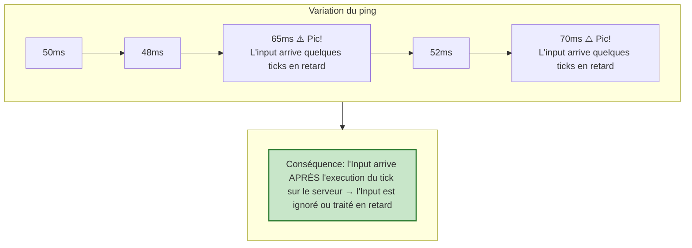

Pour compenser le jitter, on ajoute une marge de sécurité (3-5 ticks). Il est possible d'implémenter une marge de sécurité variable en fonction du jitter, mais pour cette implémentation, la marge est fixe.

#### Utilisation des Ticks dans le Système

Ce système de ticks est utilisé à travers toute l'architecture :

1. **Dans les Inputs** : Chaque input est horodaté avec son numéro de tick
2. **Dans la Simulation** : Chaque état de mouvement est associé à un tick précis
3. **Dans la Réconciliation** : Le serveur envoie "tu étais à X au Tick N", permettant au client de rejouer depuis ce tick exact

Maintenant que nous comprenons cette fondation temporelle, voyons comment les inputs sont capturés et transmis.

---

## PARTIE 1 : Les Inputs (Input System)

### 1.1 Capture et Stockage des Inputs

#### Structure d'un Input

Un **InputPayload** doit être **minimal mais complet** pour économiser la bande passante :

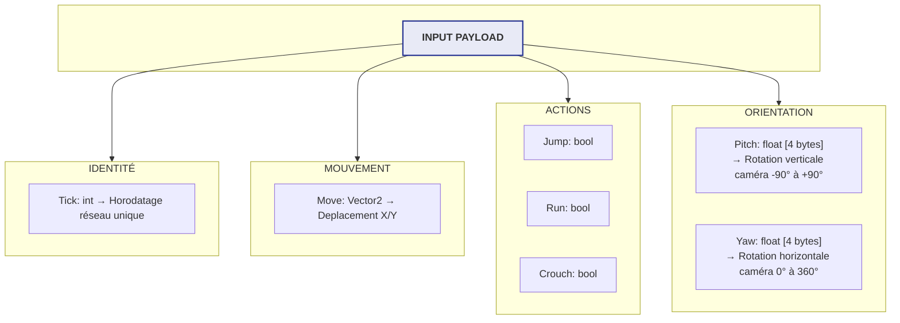

#### Le Problème des Ticks Discontinus

Deux boucles de jeu différentes sont utilisées dans notre implémentation : la boucle Update d'Unity appelée à chaque frame, et la boucle appelée pour chaque changement de tick. Ce décalage peut créer plusieurs problèmes :

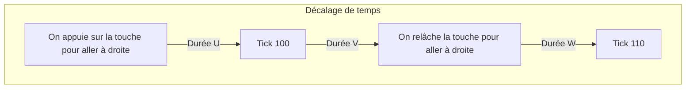

Dans cette situation, le client se sera déplacé pendant U + V, tandis que le serveur se déplacera pendant V + W.
Autrement dit, le déplacement du serveur et celui du joueur ne seront pas les mêmes. À 60Hz et un déplacement de 4m/s, le décalage U + W peut aller jusqu'à 13,5cm (2 * 1/60 * 4).
Ce problème ne peut pas être résolu avec un système de tick discontinu.

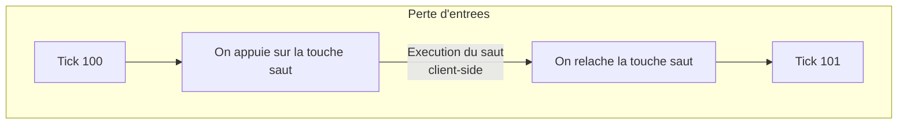

Dans cette situation, le client appuie et relâche la touche de saut ENTRE deux ticks, ce qui empêche l'envoi de l'input saut au prochain tick. Le joueur sautera donc, mais pour le serveur, il n'a jamais eu l'intention de sauter.

#### Solution : Input Accumulation (Sticky Input)

Quand on appuie sur une touche importante (comme le saut), on conserve l'input jusqu'à ce qu'il soit envoyé au serveur, pour ne pas le perdre entre deux ticks réseau.

### 1.2 Stockage en Mémoire : Le Circular Buffer

Pour stocker les inputs et les états du joueur, la structure la plus adaptée est un "Circular Buffer". Un Circular Buffer est un tableau de taille fixe, dans lequel on assigne des valeurs à un indice modulo la taille du tableau. Dans notre cas, l'indice correspond au tick de l'input ou de l'état.

#### Pourquoi pas un List<> ou Queue<> ?

| Structure | Avantages | Inconvénients | Verdict |
|-----------|-----------|---------------|----------|
| **List&lt;InputPayload&gt;** | Facile à utiliser | Croissance dynamique → Allocations mémoire Le GC provoque des freezes imprévisibles Recherche par tick : O(n) linéaire Suppression d'anciennes valeurs : O(n) | ❌ INACCEPTABLE pour temps-réel |
| **Queue&lt;InputPayload&gt;** | FIFO simple | Impossible d'accéder au milieu Recherche par tick : O(n)| ❌ Mauvais pour replay |
| **Dictionary&lt;int, InputPayload&gt;** |Accès O(1) par tick| Allocations pour chaque entrée GC problématique Surcoût mémoire hash table | ⚠️ Acceptable mais pas optimal |
| **Circular Buffer** | Taille fixe → ZÉRO allocation après init Accès O(1) Pas de GC Cache-friendly mémoire contiguë | Aucun | ✅ OPTIMAL pour netcode |

### 1.3 Redondance d'Inputs (Perte de Paquets)

#### Le Problème UDP

Le protocole **UDP** est utilisé pour l'envoi rapide de données mais ne garantit pas que les données soient reçues.

**Statistiques Réelles de Perte** :

| Qualité Connexion | Perte Typique | Perte Extrême |
|---|---|---|
| Fibre/Ethernet | 0.01% - 0.1% | 0.5% |
| WiFi bon signal | 0.1% - 1% | 5% |
| WiFi mauvais | 1% - 5% | 15% |
| 4G mobile | 1% - 3% | 10% |

Si on a des inputs importants à transmettre (saut), il y a une chance non-négligeable que l'input de saut soit perdu.

#### Solution : Input Redundancy

Au lieu d'envoyer UN seul input, on envoie **l'input actuel + les N derniers** (généralement 3-4) :

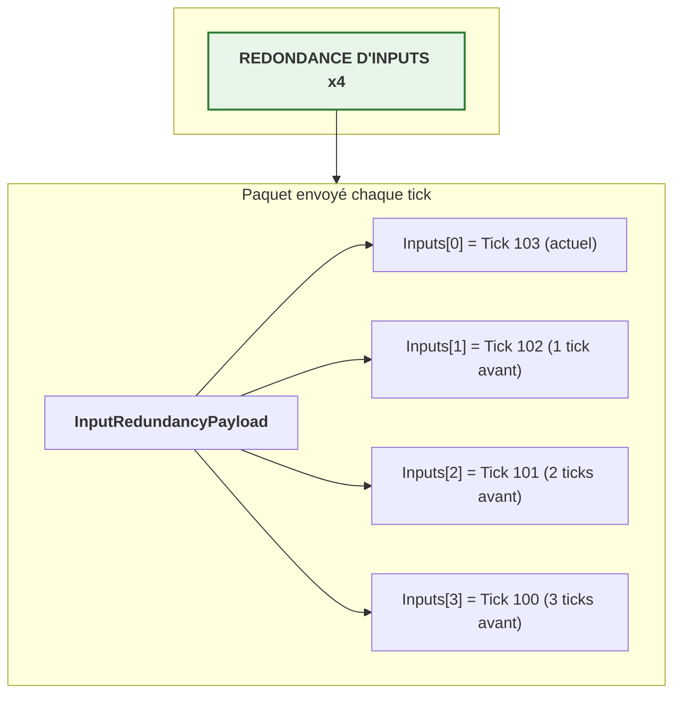

Exemple de perte de paquets :

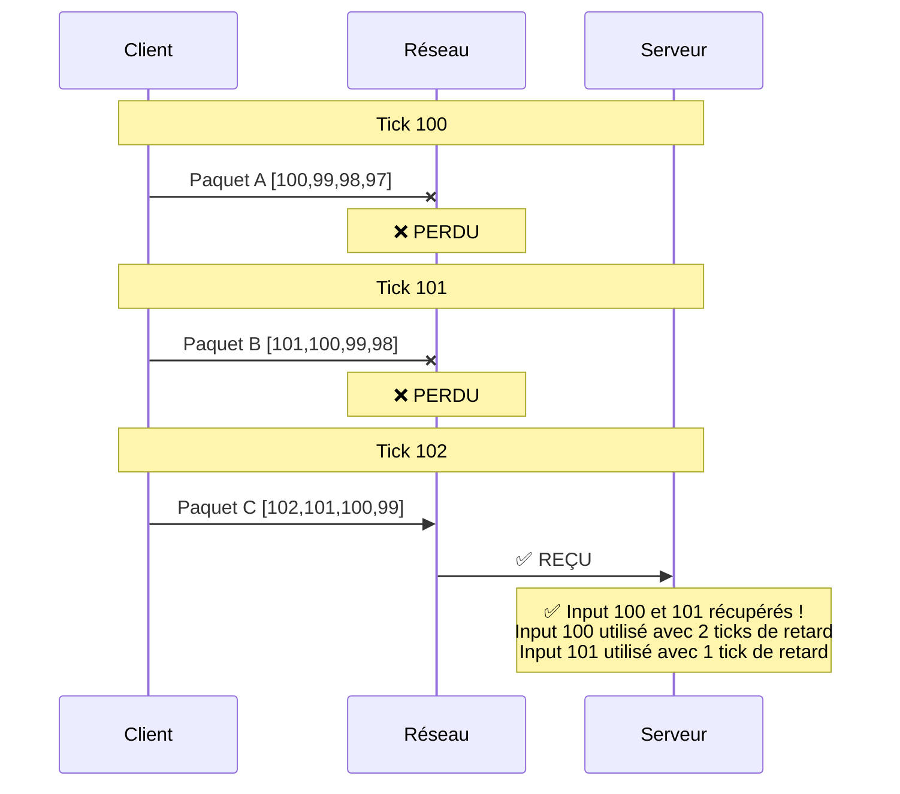

---

## PARTIE 2 : Le Calcul (Physics & Simulation)

### 2.1 L'Importance du Déterminisme

#### Qu'est-ce que le Déterminisme ?

Le déterminisme est le principe selon lequel des inputs identiques produisent **toujours** les mêmes sorties.

Dans notre contexte, il est impératif que le calcul du mouvement soit déterministe : le calcul doit produire exactement le même résultat sur le serveur et sur le client pour que la réconciliation fonctionne correctement.

### 2.2 Les Ennemis du Déterminisme

1. **Time.deltaTime Variable** : Utiliser un `fixedDeltaTime` constant (1f / tickRate).
2. **Erreurs de Virgule Flottante** : Accepter une marge d'erreur minuscule (epsilon) ou utiliser des types plus précis (fixed-point).
3. **Physics Engine Non-Déterministe (Unity)** : Éviter `Rigidbody` pour le mouvement du joueur, préférer `CharacterController` ou des raycasts manuels pour un contrôle total.

### 2.3 Architecture Physique Modulaire

Une implémentation d'un système de physique déterministe est présente dans le repository.

#### Le Pattern IPhysicsComponent

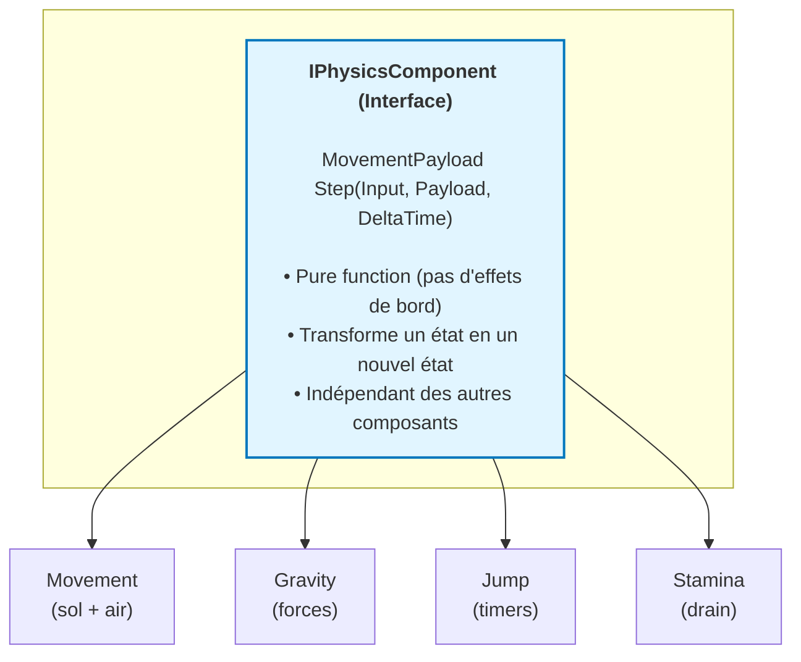

### 2.4 Le MovementPayload : État Complet

Ce système de physique prend en paramètre un état de mouvement (MovementPayload) et des inputs, puis renvoie le nouvel état de mouvement un tick plus tard. C'est une fonction pure qui facilite la prédiction et la réconciliation.

#### Structure Complète

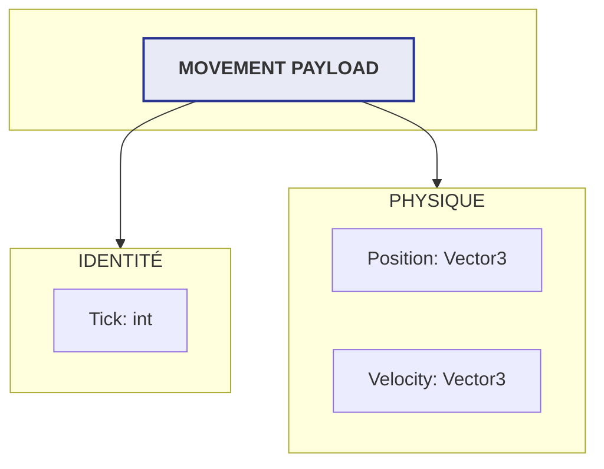

### 2.5 Application de l'Architecture Physique

À chaque tick, sur le serveur comme sur le client, on effectue un pas de simulation du mouvement.

Lors de la réconciliation, on rejoue les inputs stockés pour recalculer la position réelle du joueur et la synchroniser avec celle calculée par le serveur.

### 2.6 Design du Mouvement : Minimiser les Erreurs de Prédiction

#### Le Problème des Changements Brusques

Pour que la réconciliation fonctionne bien, il est crucial de **minimiser l'impact d'un input manquant** sur une courte période. Un mouvement avec des changements brusques amplifiera les erreurs de prédiction.

#### Exemple 1 : Accélération Instantanée

**Problème** : Vitesse instantanée 0 → 4 m/s

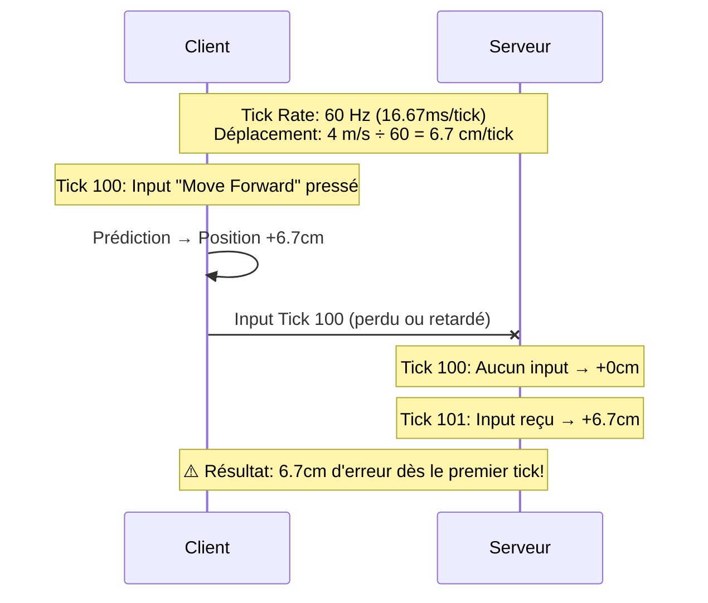

**Solution** : Accelerer progressivement le joueur, pour minimiser l'importance d'un tick.

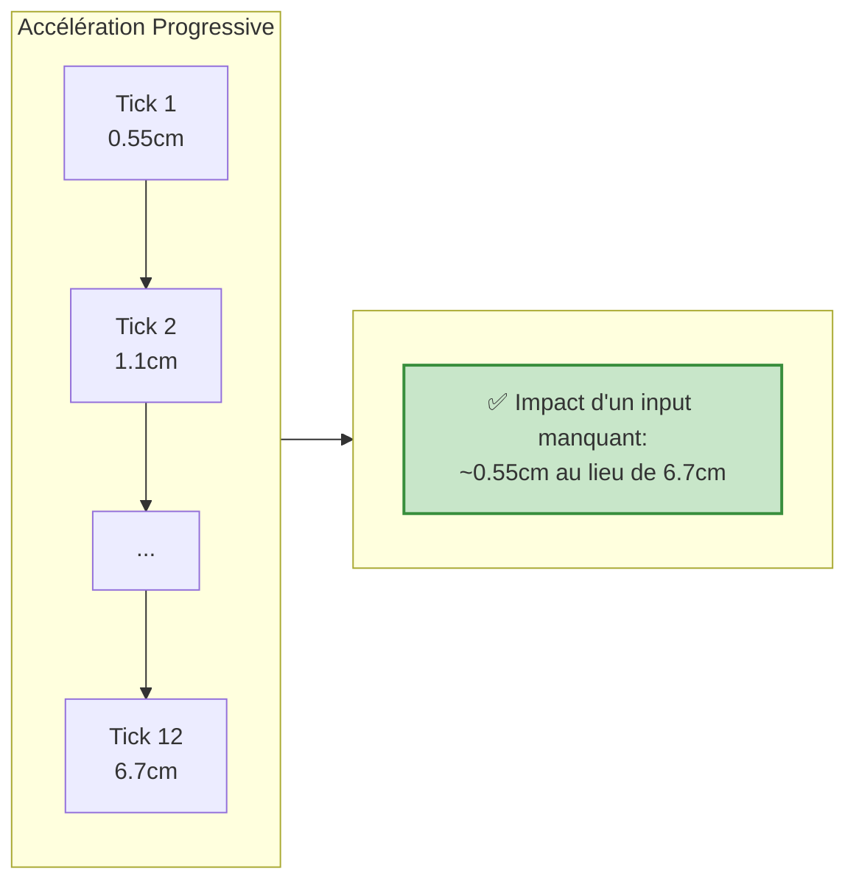

#### Recommandations de Design

**✅ Bon pour la Réconciliation** :

1. **Accélération/Décélération progressive** : Évite les changements instantanés de vélocité
2. **Contrôle aérien** : Permet des corrections en temps réel
3. **Friction élevée** : Ralentit progressivement plutôt que d'arrêter net
4. **Vitesse maximale limitée** : Réduit l'impact des erreurs de timing

**❌ Mauvais pour la Réconciliation** :

1. **Vitesse instantanée** : 0 → max en un seul tick
2. **Aucun contrôle aérien** : Amplifie les petites erreurs initiales
3. **Arrêt instantané** : Crée des divergences importantes
4. **Actions à timing critique** : Nécessitent une synchronisation parfaite (impossible)

#### Impact sur la Réconciliation

En suivant ces principes, les erreurs de prédiction restent **minimes** (< 5cm) même avec :

- Des inputs manquants ou retardés
- Du jitter réseau
- Des micro-différences de timing

Résultat : Moins de corrections visibles, gameplay plus fluide.

---

## PARTIE 3 : La Réconciliation (Correction & Synchronisation)

### 3.1 Pourquoi la Réconciliation est Nécessaire

Même avec un code parfait, des divergences apparaissent entre la prédiction client et la simulation serveur :

- **Inputs manquants/perdus** : Paquets UDP perdus en route
- **Micro-différences de calcul flottant** : Précision limitée des nombres à virgule flottante
- **Non-déterminisme du moteur physique** : Ordre d'exécution, collisions
- **Latence variable (jitter)** : Affecte le timing des inputs

### 3.2 Types de Correction

1. **Pas de correction** (Très petite erreur) : L'erreur est ignorée car imperceptible pour le joueur
2. **Smooth Correction** (Petite à moyenne erreur) : Corriger la position et lisser visuellement
3. **Hard Correction** (Grande erreur) : Téléportation brutale, visible par le joueur (lag spike sévère ou tentative de triche détectée). Dans ce cas, les jeux marquent souvent le joueur comme "Tricheur"

**Note importante** : La réconciliation permet de corriger la position du joueur, mais pour les tirs et interactions client-client, on utilise une autre technique appelée **Lag Compensation** (remonter le temps côté serveur), qui est un sujet à part.

### 3.3 Le Système de Replay

Quand le serveur envoie l'état de la position au Tick 100, et que la position client au même tick ne correspond pas, on se téléporte à cette position, puis on ré-effectue chaque tick avec les inputs associés.

### 3.4 La Correction Visuelle

C'est l'astuce qui rend le jeu fluide malgré les corrections. On sépare la **logique** (les collisions, les détections) du **visuel** (le modèle 3D, les effets, la caméra). La logique est téléportée instantanément à la bonne position après la réconciliation, tandis que le visuel est décalé de l'inverse de la correction au moment de la téléportation, puis interpolé vers 0 sur plusieurs frames. Ce modèle permet de cacher la réconciliation tout en gardant la fonctionnalité logique.

Exemple de la reconciliation d'un autre client dans mon jeu. La boule violette est le decalage visuel, et la boule rouge est la veritable position du joueur.

---

## Les Trois Perspectives

### Perspective 1 : Le Joueur (Owner Client)

**Ce qu'il voit** : Mouvement instantané et réactif (prédiction client-side)

**Ce qui se passe réellement** : Il est constamment corrigé par le serveur sur des ticks passés, mais le Visual Offset masque visuellement ces corrections pour maintenir la fluidité

### Perspective 2 : Le Serveur

**Ce qu'il voit** : La vérité absolue, l'état autoritaire du jeu

**Ce qui se passe** : Il reçoit les inputs avec retard (latence réseau), les valide pour éviter la triche, calcule l'état officiel du mouvement et le diffuse à tous les clients. Le serveur ne fait jamais de prédiction, il simule uniquement avec les inputs reçus

### Perspective 3 : Les Autres Clients (Non-Owner)

**Ce qu'ils voient** : Une interpolation lisse des états passés du serveur

**Ce qui se passe** : Ils voient l'action avec du retard, mais le mouvement est parfaitement fluide car interpolé entre les états serveur. Ils ne prédisent jamais les autres joueurs, seulement leur propre personnage

---

## Conclusion & Ressources

### Récapitulatif des 3 Parties

1. **🎮 Les Inputs** : Système de Ticks, Input Accumulation (Sticky Inputs), Circular Buffer, Redondance UDP
2. **⚙️ Le Calcul** : Déterminisme strict, Architecture modulaire (IPhysicsComponent), MovementPayload complet
3. **🔄 La Réconciliation** : Détection d'erreurs, Replay system, Smooth correction avec Visual Offset

### Vue d'Ensemble de l'Implémentation

L'implémentation d'un système de mouvement server-authoritatif peut sembler complexe, mais elle suit une logique claire en trois étapes :

#### 1. Synchronisation Temporelle (Système de Ticks)

Le système de ticks est la **fondation** de toute l'architecture. Il permet de :

- Synchroniser client et serveur sur une timeline commune
- Compenser la latence en faisant jouer le client "en avance"
- Identifier précisément chaque état du jeu pour la réconciliation

**Concrètement** : Le client calcule son tick de prédiction (tick serveur + latence + marge) et horodate tous ses inputs avec ce numéro de tick.

#### 2. Flux des Inputs et Prédiction

Le client capture ses inputs à chaque tick et :

- **Prédit immédiatement** le résultat localement (Client-Side Prediction)
- **Stocke** l'input et l'état résultant dans des circular buffers
- **Envoie** l'input au serveur avec redondance (pour contrer la perte de paquets UDP)

Le serveur, de son côté :

- **Reçoit** les inputs avec retard (latence)
- **Valide** les inputs pour éviter la triche
- **Calcule** l'état autoritaire du mouvement
- **Diffuse** l'état à tous les clients

#### 3. Réconciliation et Correction

Lorsque le client reçoit l'état autoritaire du serveur :

- **Compare** sa prédiction avec la vérité serveur
- **Si l'erreur est minime** : On ignore
- **Si l'erreur est modérée** :
  - Téléporte la logique à la position serveur
  - Rejoue tous les inputs depuis l'etat du serveur recu
  - Masque visuellement avec le Visual Offset
- **Si l'erreur est énorme** (> 80cm) : téléportation brutale (lag spike sévère)

### Le Résultat Final

**Un mouvement qui semble instantané pour le joueur**, tout en étant entièrement validé et sécurisé par le serveur. C'est le standard de l'industrie utilisé par les jeux AAA compétitifs comme *Overwatch*, *Valorant*, *Apex Legends* et *Counter-Strike*.

### Ressources Complémentaires

[Fast-Paced Multiplayer (Part I): Client-Server Game Architecture (Gabriel Gambetta)](https://www.gabrielgambetta.com/client-server-game-architecture.html)
[Server In-game Protocol Design and Optimization (Valve)](https://developer.valvesoftware.com/wiki/Latency_Compensating_Methods_in_Client/Server_In-game_Protocol_Design_and_Optimization)
[Unity Netcode 100% Server Authoritative with Client Prediction and Reconciliation (git-amend)](https://youtu.be/-lGsuCEWkM0?si=jLWQwQjHxf2rzU9s)

Bon courage dans votre implémentation !
